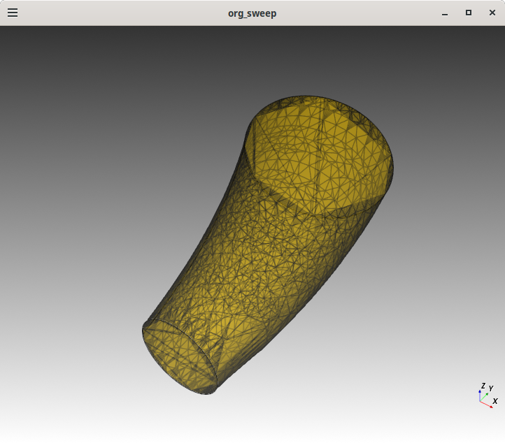
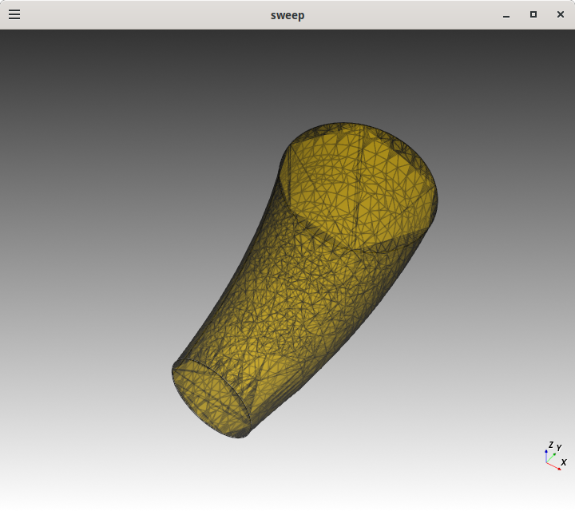

# cq-multisection-sweep

Mulitple sections using CadQuery sweep with circle(4) and circle(2) along a spline path.

The primary thing I've believed I learned is that there is a "stack" talked about
in the CadQuery docs and in this example it comes into play when we call the
consolidateWires is called. But another important notion is list of
Workplanes that are created when methods such as `pushPoints` and `circle`
are invoked. This list of Workplanes with a set of objects on in their stacks
and together a final shape when they when they are in a lazy evaluated when
"rendering" occurs such as `show` and `export`.

## Info
Based on: https://github.com/CadQuery/cadquery/issues/507#issuecomment-729078867
Some visulization of the docs: https://cadquery.readthedocs.io/en/latest/vis.html

## Usage

Here is the print output of x.py
```bash
$ ./x.py 
wp: <cadquery.cq.Workplane object at 0x7a0ccf051430>
wp.size(): 0
type(wp): <class 'cadquery.cq.Workplane'>
path: <cadquery.cq.Workplane object at 0x7a0be80063f0>
path.size(): 1
type(path): <class 'cadquery.cq.Workplane'>
path.val(): <cadquery.occ_impl.shapes.Edge object at 0x7a0be9a33320>
type(path.val()): <class 'cadquery.occ_impl.shapes.Edge'>
first_item: <cadquery.cq.Workplane object at 0x7a0be7ea6d50>, path.size(): 1
type(first_item): <class 'cadquery.cq.Workplane'>
loc0: ((50.0, 0.0, -5.0), (90.00000000000001, -8.617315340090216e-14, 178.6728869242176)), path.size(): 1
loc1: ((48.0, 14.0, -5.0), (90.0, -8.746525374024668e-14, -162.59295659170937)), path.size(): 1
org_sweep wp.size=1, parents=6, wire_count=0, edge_count=0, obj_count=1
wp2 wp.size=0, parents=0, wire_count=0, edge_count=0, obj_count=0
pushPoints(loc0) wp.size=1, parents=1, wire_count=0, edge_count=0, obj_count=1
circle(2) wp.size=1, parents=2, wire_count=1, edge_count=0, obj_count=1
pushPoints(loc1) wp.size=1, parents=3, wire_count=1, edge_count=0, obj_count=1
circle(4) wp.size=1, parents=4, wire_count=2, edge_count=0, obj_count=1
consolidatedWires wp.size=2, parents=5, wire_count=2, edge_count=0, obj_count=2
sweep wp.size=1, parents=6, wire_count=0, edge_count=0, obj_count=1
export sweep wp.size=1, parents=6, wire_count=0, edge_count=0, obj_count=1
exiting sweep wp.size=1, parents=6, wire_count=0, edge_count=0, obj_count=1
```

## The images output are identical

Original sweep:


Sweep broken down in separate steps:


## License

Licensed under either of

- Apache License, Version 2.0 ([LICENSE-APACHE](LICENSE-APACHE) or http://apache.org/licenses/LICENSE-2.0)
- MIT license ([LICENSE-MIT](LICENSE-MIT) or http://opensource.org/licenses/MIT)

### Contribution

Unless you explicitly state otherwise, any contribution intentionally submitted
for inclusion in the work by you, as defined in the Apache-2.0 license, shall
be dual licensed as above, without any additional terms or conditions.
